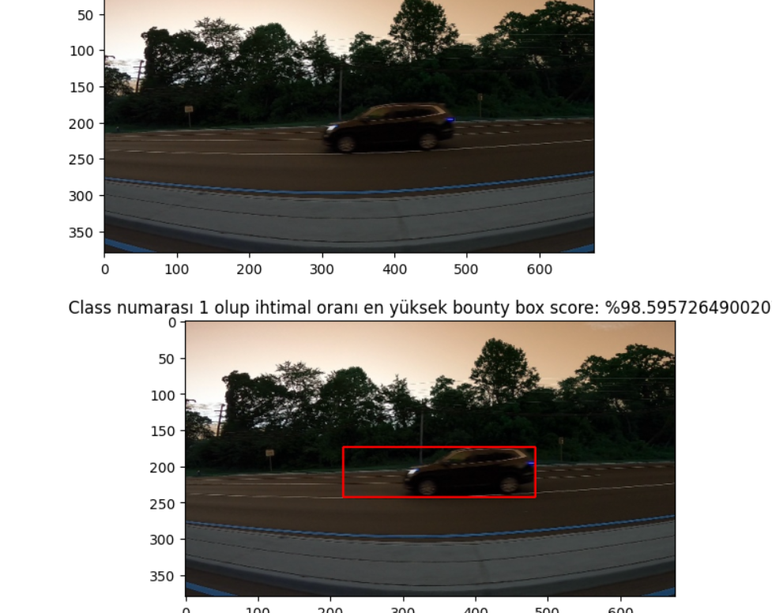

# 🚗 Car Detection using Selective Search and VGG16

This project implements a **car detection system** that combines **Selective Search** for region proposal with a **fine-tuned VGG16 CNN** for binary classification.  
The pipeline detects and highlights cars in images by drawing bounding boxes around regions with the highest confidence.

---

## 🧠 Overview
- **Region Proposal:** Selective Search generates possible bounding boxes for objects in the image.  
- **Feature Extraction:** VGG16 pretrained on ImageNet is used as the backbone network.  
- **Classification:** Each proposed region is classified as “car” or “no car”.  
- **Result:** The region with the highest probability of containing a car is displayed.

---

## 🛠 Tech Stack
- Python 3.8+  
- TensorFlow / Keras  
- OpenCV  
- scikit-learn  
- NumPy, Pandas, Matplotlib  

---

## ⚙️ How It Works

### 1. Preprocessing
- Load bounding box annotations from CSV.  
- Crop regions from training images and resize to **224×224**.  
- Label regions as `1 (car)` or `0 (no car)` using IoU thresholding.  

### 2. Training
- Split dataset: **70% training / 30% validation**.  
- Fine-tune VGG16 (with ImageNet weights, top layers removed).  
- Add custom classifier:  
  - GlobalAveragePooling  
  - Dropout(0.5)  
  - Dense(1, sigmoid)

### 3. Region Proposal (Inference)
- Use Selective Search to generate bounding boxes on test images.  
- Classify each region using the trained model.  
- Draw the box with **highest confidence score**.

---

## 📊 Model Performance
| Metric | Value |
|--------|--------|
| Validation Accuracy | **~97.2%** |
| Loss | **0.10 (approx.)** |

---

## 🖼 Example Output
Below is an example showing the highest-confidence bounding box drawn around the detected car:

---

## 📦 Data Handling
- Uses `.pkl` files to save and reload processed data efficiently.  
- CSV annotation file: `train_solution_bounding_boxes.csv`  
- Image dataset: `training_images/`, `testing_images/`

---

## 📌 Notes
- Selective Search generates many region proposals — only the one with the highest score is visualized.  
- Works best with daylight, high-resolution images.  
- For more robustness, could integrate with Faster R-CNN or YOLO architectures.

---

## 🎯 Key Learning Outcomes
- Built an **end-to-end object detection pipeline** from scratch.  
- Learned how **region proposal** and **CNN-based classification** interact.  
- Gained experience fine-tuning **VGG16** for a domain-specific task.
